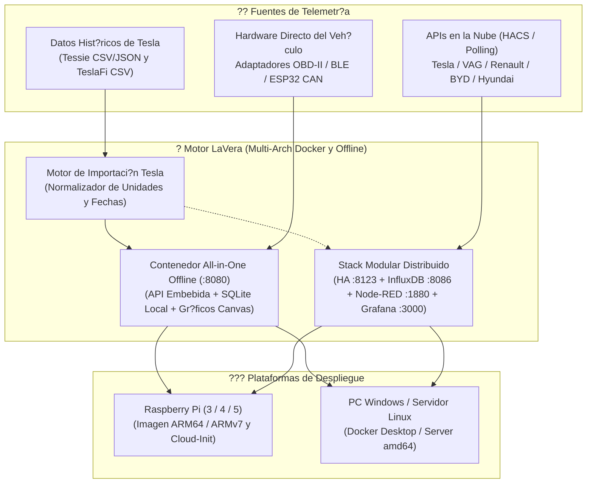

# ? LaVera - Hub Universal de Telemetr?a EV ????

?? **Idioma / Language:** [English](README.md) | **Espa?ol**

Plataforma auto-hospedada, modular y enfocada en la privacidad para la extracci?n, normalizaci?n, almacenamiento de series temporales y visualizaci?n de telemetr?a de **Veh?culos El?ctricos (EV)** multimarca (Tesla, Grupo VAG, Renault/Dacia, BYD, Hyundai/Kia, Stellantis, OBD-II/BLE, Tronity, etc.).

[](ev-telemetry-hub/docker-compose.all-in-one.yml)
[](scripts/build-arm-image.sh)
[](ev-telemetry-hub/all-in-one/)
[](ev-telemetry-hub/importer/)
[](https://www.influxdata.com/)
[](https://grafana.com/)

---

## ?? ?Qu? es LaVera?

**LaVera** proporciona una soluci?n integral y de c?digo abierto para propietarios y entusiastas del veh?culo el?ctrico:
1. **Soberan?a y Privacidad de Datos:** Mant?n el 100% de la telemetr?a en tu propia infraestructura local (Mini PC, Raspberry Pi, servidor dom?stico o Docker Desktop en Windows/Linux) sin depender de servicios de terceros ni cuotas de suscripci?n.
2. **Capacidad 100% Offline:** Funciona con total autonom?a sin conexi?n a Internet (en garajes subterr?neos o instalado directamente en el veh?culo) gracias a un panel web integrado sin CDNs y almacenamiento persistente en SQLite de series temporales.
3. **Migraci?n Hist?rica de Tesla (Tessie y TeslaFi):** Importa a?os de trayectos, sesiones de carga, consumo par?sito (*vampire drain*) y curvas de degradaci?n de bater?a desde **Tessie** (CSV/JSON) y **TeslaFi** (CSV) con normalizaci?n autom?tica de unidades y fechas.
4. **Multi-Arquitectura y Appliance ARM:** Compatibilidad nativa optimizada para **Raspberry Pi (3, 4, 5)** y SBCs ARM (`linux/arm64`, `linux/arm/v7`, `linux/amd64`) con script generador de im?genes y plantillas `cloud-init` listas para flashear.
5. **Compatibilidad Multimarca:** Conexi?n con APIs oficiales de fabricantes (v?a integraciones de Home Assistant y HACS) y lectura directa por hardware mediante adaptadores OBD-II / BLE / bus CAN.

---

## ??? Arquitectura del Sistema



---

## ?? Perfiles de Despliegue

LaVera ofrece dos modalidades de despliegue:

### 1. Hub All-in-One Offline (Recomendado para Raspberry Pi y Funcionamiento Local)
Un ?nico contenedor Docker ultra ligero y sin configuraci?n previa que incluye:
- Panel web interactivo integrado (zero-CDN, 100% offline).
- Importador visual de Tessie y TeslaFi mediante arrastrar y soltar.
- Almacenamiento local persistente en SQLite con sincronizaci?n opcional a InfluxDB.
- Compatibilidad multi-arquitectura: `linux/amd64`, `linux/arm64`, `linux/arm/v7`.

```bash
cd ev-telemetry-hub
docker compose -f docker-compose.all-in-one.yml up -d
```
Abre tu navegador en `http://localhost:8080` (o `http://lavera.local:8080` en Raspberry Pi).

### 2. Stack Modular Distribuido (Home Assistant + InfluxDB + Node-RED + Grafana)
Entorno multi-servicio completo para monitorizaci?n multimarca mediante APIs oficiales y cuadros anal?ticos avanzados en Grafana.

```bash
cd ev-telemetry-hub
cp .env.example .env
docker compose up -d
```
- **Home Assistant:** `http://localhost:8123`
- **Grafana:** `http://localhost:3000`
- **Node-RED:** `http://localhost:1880`
- **InfluxDB 2.7:** `http://localhost:8086`

---

## ?? Importaci?n de Datos de Tesla (Tessie y TeslaFi)

Si vienes de utilizar **Tessie** o **TeslaFi**, LaVera te permite consolidar tu hist?rico sin perder informaci?n:

### Formatos Soportados
- **TeslaFi:**
  - `drives.csv` (Fecha, Distancia, SoC inicial/final, Wh/mi o Wh/km, Temperaturas, Ubicaciones).
  - `charges.csv` (Energ?a a?adida kWh, Rango a?adido, Potencia m?x kW, Coste, Carga r?pida).
  - `battery_report.csv` / `calendar.csv` (Degradaci?n %, Autonom?a al 100%, Capacidad kWh).
  - `idles.csv` / `sleep.csv` (Duraci?n de inactividad/sue?o y consumo par?sito / *phantom drain*).
- **Tessie:**
  - Exportaci?n completa en JSON (`drives`, `charges`, `battery_health`).
  - Exportaciones en CSV de trayectos y sesiones de carga.

### M?todos de Importaci?n
1. **Panel Web:** Entra en `http://localhost:8080` ? Ve a la pesta?a **Importar Tessie / TeslaFi** ? Arrastra y suelta tus archivos CSV o JSON.
2. **Utilidad CLI:**
   ```bash
   # Importar trayectos de TeslaFi
   python -m importer.cli --source teslafi --type drives --file /ruta/a/drives.csv --vin MI_TESLA

   # Importar exportaci?n JSON de Tessie
   python -m importer.cli --source tessie --file /ruta/a/tessie.json --vin MI_TESLA
   ```

---

## ?? Grabaci?n en Raspberry Pi con Imager y BalenaEtcher

?? **[Gu?a Paso a Paso para Raspberry Pi Imager y Balena (docs/GUIA_FLASHEO.md)](docs/GUIA_FLASHEO.md)**

## ?? Raspberry Pi e Im?genes para Dispositivos ARM

LaVera se puede desplegar como un dispositivo aut?nomo tipo *appliance* en Raspberry Pi (3, 4, 5) y placas ARM (Orange Pi, Rock Pi, Armbian):

### Opci?n 1: Flasheo Automatizado con Raspberry Pi Imager (`cloud-init`)
Utiliza la plantilla preconfigurada [`scripts/cloud-init-lavera.yaml`](scripts/cloud-init-lavera.yaml) en **Raspberry Pi Imager** (dentro de las opciones de personalizaci?n de SO / *user-data*). Al encender la Raspberry Pi:
1. Docker y Avahi (mDNS) se instalan de forma desatendida.
2. LaVera All-in-One se inicia autom?ticamente como servicio de sistema `systemd`.
3. Podr?s acceder al panel desde el m?vil, ordenador o pantalla del coche en `http://lavera.local:8080`.

### Opci?n 2: Compilar Paquete / Tarball para ARM
Ejecuta el script generador desde cualquier estaci?n Linux o WSL:
```bash
bash scripts/build-arm-image.sh arm64
```
El script generar? las capas Docker multi-arquitectura y empaquetar? el bundle con el instalador de servicio listo para transferir por USB o SCP.

---

## ?? Estructura del Repositorio

```text
LaVera/
??? .gitignore                          # Exclusiones de Git (datos locales, .env)
??? README.md                           # Documentaci?n principal en ingl?s
??? README.es.md                        # Documentaci?n principal en espa?ol
??? GUIDE.md                            # Gu?a exhaustiva paso a paso (ingl?s)
??? GUIA.md                             # Gu?a exhaustiva paso a paso (espa?ol)
??? scripts/
?   ??? build-arm-image.sh              # Generador de imagen ARM y Raspberry Pi
?   ??? cloud-init-lavera.yaml          # Plantilla desatendida para Raspberry Pi Imager
?   ??? lavera-service.sh               # Instalador de servicio en systemd
??? ev-telemetry-hub/
    ??? Dockerfile.all-in-one           # Contenedor multi-arch offline (amd64, arm64, arm/v7)
    ??? docker-compose.all-in-one.yml   # Compose para despliegue de contenedor ?nico
    ??? docker-compose.yml              # Stack distribuido de 4 contenedores
    ??? .env.example                    # Plantilla de credenciales
    ??? importer/                       # Normalizadores y CLI de importaci?n Tesla
    ?   ??? normalizer.py
    ?   ??? teslafi_parser.py
    ?   ??? tessie_parser.py
    ?   ??? writer.py
    ?   ??? cli.py
    ??? all-in-one/                     # API Offline y Panel Web Zero-CDN
    ?   ??? app.py                      # Servidor HTTP y API multi-arch
    ?   ??? storage.py                  # Motor de base de datos local SQLite
    ?   ??? web/                        # Interfaz gr?fica responsive en modo oscuro
    ?       ??? index.html
    ?       ??? styles.css
    ?       ??? chart-mini.js           # Motor de gr?ficos Canvas offline sin librer?as externas
    ?       ??? app.js
    ??? tests/                          # Bater?a de pruebas unitarias y de integraci?n API
        ??? test_importers.py
        ??? test_all_in_one_api.py
```

---

## ?? Gu?a Exhaustiva de Despliegue e Integraci?n

Para detalles de conexi?n con cada marca, tokens de InfluxDB, prevenci?n del consumo par?sito (*phantom drain*) y paneles en Grafana:

?? **[Leer la Gu?a Completa Paso a Paso (Espa?ol - GUIA.md)](GUIA.md)**  
?? **[Read the Complete Step-by-Step Guide (English - GUIDE.md)](GUIDE.md)**

---

## ??? Seguridad y Buenas Pr?cticas

- **Mant?n `.env` Privado:** Contiene credenciales y tokens maestros (ignorado en Git).
- **Evita el Vampire Drain:** Respeta los intervalos de reposo del veh?culo para evitar agotar la bater?a de 12V.
- **Operaci?n 100% Offline:** El contenedor All-in-One no realiza ninguna petici?n externa a Internet, garantizando m?xima privacidad.
- **Acceso Remoto Seguro:** Utiliza redes privadas cifradas como **Tailscale / WireGuard** o Cloudflare Tunnels en lugar de exponer puertos al Internet p?blico.

---

## ?? Licencia

Este proyecto est? liberado bajo la Licencia MIT. Consulta el archivo de licencia para m?s detalles.
