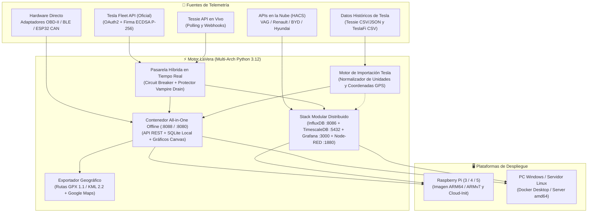

# ⚡ LaVera - Hub Universal de Telemetría EV 🚗🔌

🌐 **Idioma / Language:** [English](README.md) | **Español**

Plataforma auto-hospedada, modular y enfocada en la privacidad para la extracción, normalización, almacenamiento de series temporales y visualización de telemetría de **Vehículos Eléctricos (EV)** multimarca (Tesla, Grupo VAG, Renault/Dacia, BYD, Hyundai/Kia, Stellantis, OBD-II/BLE, Tronity, etc.).

[](ev-telemetry-hub/docker-compose.all-in-one.yml)
[](scripts/build-arm-image.sh)
[](ev-telemetry-hub/all-in-one/)
[](ev-telemetry-hub/importer/)
[](ev-telemetry-hub/gateway/)
[](https://www.influxdata.com/)
[](https://www.timescale.com/)
[](https://grafana.com/)

---

## 🚀 ¿Qué es LaVera?

**LaVera** proporciona una solución integral, privada y de código abierto para propietarios y entusiastas del vehículo eléctrico:

1. **Soberanía y Privacidad de Datos:** Mantén el 100% de la telemetría en tu propia infraestructura local (Mini PC, Raspberry Pi, servidor doméstico o Docker Desktop en Windows/Linux) sin depender de servicios de terceros ni cuotas de suscripción recurrentes.
2. **Capacidad 100% Offline:** Funciona con total autonomía sin conexión a Internet (en garajes subterráneos o instalado directamente en el vehículo) gracias a un panel web integrado sin CDNs externas y almacenamiento persistente en SQLite de series temporales.
3. **Pasarela Híbrida en Tiempo Real (`gateway/`):** Conexión directa y continua con la **Tesla Fleet API** oficial (autenticación OAuth2 y firma de comandos con clave elíptica ECDSA NIST P-256) y con la **Tessie API**, incorporando protección inteligente contra el consumo parásito (*vampire drain*) y *circuit breaker* para resguardar las cuotas de red.
4. **Exportación Geográfica y Rutas (GPX, KML y Google Maps):** Extrae coordenadas GPS reales de cada viaje y genera archivos descargables compatibles con **Garmin, Strava, OsmAnd (GPX 1.1)** y **Google Earth (KML 2.2)**, con acceso directo a rutas en **Google Maps** mediante coordenadas exactas de origen y destino.
5. **Migración Histórica de Tesla (Tessie y TeslaFi):** Importa años de trayectos, sesiones de carga, consumo parásito (*vampire drain*) y curvas de degradación de batería desde **Tessie** (CSV/JSON) y **TeslaFi** (CSV) con normalización automática de unidades y fechas.
6. **Almacenamiento de Series Temporales (SQLite, InfluxDB v2 y TimescaleDB):** Soporte de escritura nativa en InfluxDB v2 mediante Line Protocol e inyector continuo ([`scripts/influx_telemetry_injector.py`](ev-telemetry-hub/scripts/influx_telemetry_injector.py)), además de TimescaleDB (PostgreSQL 16) para análisis a gran escala.
7. **Multi-Arquitectura y Appliance ARM:** Base optimizada sobre **Python 3.12 LTS Slim**, con compatibilidad validada para **Raspberry Pi (3, 4, 5)** y placas ARM (`linux/arm64`, `linux/arm/v7`, `linux/amd64`), scripts de compilación de imágenes y soporte de flasheo para BalenaEtcher y Raspberry Pi Imager.

---

## 📐 Arquitectura del Sistema


```mermaid
flowchart TD
    subgraph Sources ["📡 Fuentes de Telemetría"]
        TeslaFleet["Tesla Fleet API (Oficial)
(OAuth2 + Firma ECDSA P-256)"]
        TessieAPI["Tessie API en Vivo
(Polling y Webhooks)"]
        TeslaHist["Datos Históricos de Tesla
(Tessie CSV/JSON y TeslaFi CSV)"]
        OEM["APIs en la Nube (HACS)
VAG / Renault / BYD / Hyundai"]
        OBD["Hardware Directo
Adaptadores OBD-II / BLE / ESP32 CAN"]
    end

    subgraph CoreEngine ["⚡ Motor LaVera (Multi-Arch Python 3.12)"]
        direction TB
        Gateway["Pasarela Híbrida en Tiempo Real
(Circuit Breaker + Protector Vampire Drain)"]
        Importer["Motor de Importación Tesla
(Normalizador de Unidades y Coordenadas GPS)"]
        AllInOne["Contenedor All-in-One Offline (:8088 / :8080)
(API REST + SQLite Local + Gráficos Canvas)"]
        GeoExport["Exportador Geográfico
(Rutas GPX 1.1 / KML 2.2 + Google Maps)"]
        ModStack["Stack Modular Distribuido
(InfluxDB :8086 + TimescaleDB :5432 + Grafana :3000 + Node-RED :1880)"]
    end

    subgraph Targets ["🖥️ Plataformas de Despliegue"]
        RPi["Raspberry Pi (3 / 4 / 5)
(Imagen ARM64 / ARMv7 y Cloud-Init)"]
        WinLin["PC Windows / Servidor Linux
(Docker Desktop / Server amd64)"]
    end

    TeslaFleet --> Gateway
    TessieAPI --> Gateway
    TeslaHist --> Importer
    OBD --> AllInOne
    OEM --> ModStack

    Gateway --> AllInOne
    Gateway --> ModStack
    Importer --> AllInOne
    Importer -.-> ModStack
    AllInOne --> GeoExport

    AllInOne --> RPi
    AllInOne --> WinLin
    ModStack --> WinLin
    ModStack --> RPi
```

---

## 📦 Perfiles de Despliegue

LaVera ofrece dos modalidades de despliegue según tus requerimientos:

### 1. Hub All-in-One Offline (Recomendado para Raspberry Pi y Uso Autónomo)
Un único contenedor Docker ultra ligero (base Python 3.12-slim) y sin configuración previa que incluye:
- Panel web interactivo integrado (zero-CDN, 100% offline).
- Pasarela híbrida en vivo y protector contra el *vampire drain*.
- Importador visual de Tessie y TeslaFi mediante arrastrar y soltar.
- Exportación geográfica de trayectos en **GPX** y **KML** con enlace a **Google Maps**.
- Almacenamiento local persistente en SQLite con sincronización opcional a InfluxDB.
- Compatibilidad multi-arquitectura: `linux/amd64`, `linux/arm64`, `linux/arm/v7`.

```bash
cd ev-telemetry-hub
docker compose -f docker-compose.all-in-one.yml up -d
```
Abre tu navegador en `http://localhost:8088` o `http://localhost:8080` (o `http://lavera.local:8088` en Raspberry Pi).

### 2. Stack Modular Distribuido (InfluxDB 2.7 + TimescaleDB + Grafana + Node-RED + Home Assistant)
Entorno multi-servicio completo para almacenamiento de series temporales de alta resolución, integración multimarca y cuadros analíticos avanzados en Grafana.

```bash
cd ev-telemetry-hub
cp .env.example .env
docker compose up -d
```
- **Panel LaVera Hub:** `http://localhost:8088`
- **InfluxDB v2:** `http://localhost:8086` *(Org: `lavera`, Bucket: `ev_telemetry`)*
- **Grafana:** `http://localhost:3000` *(Usuario: `admin` / Contraseña: en `.env`)*
- **TimescaleDB (PostgreSQL 16):** `localhost:5432` *(Usuario: `lavera`, BD: `lavera_telemetry`)*
- **Node-RED:** `http://localhost:1880`
- **Home Assistant:** `http://localhost:8123`

---

## 🗺️ Rutas y Exportación Geográfica (GPX, KML y Google Maps)

LaVera extrae automáticamente los puntos GPS (`latitude`, `longitude`) de los trayectos importados o recibidos en vivo:

- **Descarga GPX 1.1:** Compatible con Garmin Connect, Strava, Komoot y OsmAnd (`/api/drives/export?id=<ID>&format=gpx`).
- **Descarga KML 2.2:** Compatible con Google Earth y visualizadores GIS (`/api/drives/export?id=<ID>&format=kml`).
- **Navegación en Google Maps:** Enlace directo en cada fila de trayecto con las coordenadas exactas de origen y destino (`https://www.google.com/maps/dir/?api=1&origin=LAT,LON&destination=LAT,LON`).

---

## 🔄 Importación de Datos de Tesla (Tessie y TeslaFi)

Si vienes de utilizar **Tessie** o **TeslaFi**, LaVera consolida todo tu histórico:

### Formatos Soportados
- **TeslaFi:**
  - `drives.csv` (Fecha, Distancia, SoC inicial/final, Wh/km, Temperaturas, Ubicaciones, Coordenadas GPS, Autopilot).
  - `charges.csv` (Energía añadida kWh, Rango añadido, Potencia máx kW, Coste, Carga rápida).
  - `battery_report.csv` / `calendar.csv` (Degradación %, Autonomía al 100%, Capacidad kWh).
  - `idles.csv` / `sleep.csv` (Duración de inactividad/sueño y consumo parásito / *phantom drain*).
- **Tessie:**
  - Exportación completa en JSON (`drives`, `charges`, `battery_health`).
  - Exportaciones en CSV de trayectos y sesiones de carga con coordenadas completas.

### Métodos de Importación
1. **Panel Web:** Entra en `http://localhost:8088` ➔ Pestaña **Importar Tessie / TeslaFi** ➔ Arrastra y suelta tus archivos CSV o JSON.
2. **Utilidad CLI:**
   ```bash
   # Importar trayectos de TeslaFi
   python -m importer.cli --source teslafi --type drives --file /ruta/a/drives.csv --vin MI_TESLA

   # Importar exportación JSON de Tessie
   python -m importer.cli --source tessie --file /ruta/a/tessie.json --vin MI_TESLA
   ```

---

## 🥧 Raspberry Pi e Imágenes para Dispositivos ARM

LaVera se puede desplegar como un dispositivo autónomo tipo *appliance* en Raspberry Pi (3, 4, 5) y placas ARM (Orange Pi, Rock Pi, Armbian):

📖 **[Guía Paso a Paso para Raspberry Pi Imager y Balena (docs/GUIA_FLASHEO.md)](docs/GUIA_FLASHEO.md)**

### Opción 1: Generar Imagen Flasheable (.img.xz)
Descarga la última versión oficial de Raspberry Pi OS Lite e inyecta la configuración completa de LaVera:
```bash
python scripts/create-pi-image.py --username lavera --password lavera
```

### Opción 2: Flasheo con `cloud-init` en Raspberry Pi Imager
Utiliza la plantilla preconfigurada [`scripts/cloud-init-lavera.yaml`](scripts/cloud-init-lavera.yaml) en **Raspberry Pi Imager** (dentro de las opciones de personalización de SO / *user-data*). Al encender la Raspberry Pi:
1. Docker y Avahi (mDNS) se instalan de forma desatendida.
2. LaVera All-in-One se inicia automáticamente como servicio de sistema `systemd`.
3. Accede al panel desde el móvil, ordenador o pantalla del coche en `http://lavera.local:8088`.

### Opción 3: Compilar Paquete / Tarball para ARM
Ejecuta el script generador desde cualquier estación Linux o WSL:
```bash
bash scripts/build-arm-image.sh arm64
```

---

## 📁 Estructura del Repositorio

```text
LaVera/
├── .gitignore                          # Exclusiones de Git (datos locales, .env, dist-pi/)
├── README.md                           # Documentación principal en inglés
├── README.es.md                        # Documentación principal en español
├── GUIDE.md                            # Guía exhaustiva paso a paso (inglés)
├── GUIA.md                             # Guía exhaustiva paso a paso (español)
├── Dockerfile                          # Dockerfile raíz multi-arch Python 3.12
├── docker-compose.yml                  # Stack distribuido completo (Hub, InfluxDB, TimescaleDB, Grafana, HA)
├── docker-compose.all-in-one.yml       # Stack standalone All-in-One
├── scripts/
│   ├── create-pi-image.py              # Generador de imagen bootfs / SD para Raspberry Pi
│   ├── build-arm-image.sh              # Compilación de contenedores multi-arch para ARM
│   ├── cloud-init-lavera.yaml          # Plantilla desatendida para Raspberry Pi Imager
│   └── lavera-service.sh               # Instalador de servicio en systemd
└── ev-telemetry-hub/
    ├── Dockerfile.all-in-one           # Contenedor multi-arch offline (amd64, arm64, arm/v7)
    ├── docker-compose.all-in-one.yml   # Compose local para despliegue ligero
    ├── docker-compose.yml              # Compose del hub con dependencias
    ├── .env.example                    # Plantilla de credenciales y variables de entorno
    ├── gateway/                        # Pasarela híbrida de telemetría en tiempo real
    │   ├── __init__.py
    │   ├── base.py                     # Interfaz base de proveedores de telemetría
    │   ├── tesla_fleet_provider.py     # Cliente Tesla Fleet API con firma ECDSA NIST P-256
    │   ├── tessie_provider.py          # Cliente Tessie API en vivo con sondeo adaptativo
    │   ├── polling_manager.py          # Gestor de reposo y protección contra vampire drain
    │   ├── circuit_breaker.py          # Protección de cuotas y desconexión por fallos
    │   ├── influx_parser.py            # Conversor canónico a InfluxDB Line Protocol
    │   ├── models.py                   # Modelos de datos canónicos unificados
    │   ├── security.py                 # Gestión de tokens y criptografía de clave pública
    │   ├── database.py                 # Capa de almacenamiento SQLite / TimescaleDB
    │   └── orchestrator.py             # Orquestador del ciclo de vida del gateway
    ├── importer/                       # Normalizadores y CLI de importación Tesla
    │   ├── normalizer.py
    │   ├── teslafi_parser.py           # Parser TeslaFi con extracción de coordenadas GPS
    │   ├── tessie_parser.py            # Parser Tessie con extracción de coordenadas GPS
    │   ├── writer.py                   # Escritor en SQLite, TimescaleDB e InfluxDB
    │   └── cli.py                      # Interfaz de línea de comandos para importación
    ├── scripts/
    │   └── influx_telemetry_injector.py # Inyector HTTP de telemetría hacia InfluxDB v2
    ├── all-in-one/                     # API Offline y Panel Web Zero-CDN
    │   ├── app.py                      # Servidor HTTP, API REST y exportador GPX/KML
    │   ├── storage.py                  # Motor de base de datos local SQLite y métricas
    │   └── web/                        # Interfaz gráfica responsive en modo oscuro
    │       ├── index.html
    │       ├── styles.css
    │       ├── chart-mini.js           # Motor de gráficos Canvas offline sin librerías externas
    │       ├── app.js                  # Lógica de cliente, enlaces de mapas y descargas
    │       └── i18n.js                 # Traducciones multilingües (ES, EN, DE, FR, NO)
    └── tests/                          # Batería de pruebas unitarias y de integración API
        ├── test_importers.py
        ├── test_all_in_one_api.py
        └── test_timescaledb.py
```

---

## 📖 Guías Exhaustivas de Despliegue e Integración

Para detalles de conexión con cada marca, tokens de InfluxDB, prevención del consumo parásito (*phantom drain*) y paneles en Grafana:

📘 **[Leer la Guía Completa Paso a Paso (Español - GUIA.md)](GUIA.md)**  
📘 **[Read the Complete Step-by-Step Guide (English - GUIDE.md)](GUIDE.md)**

---

## 🔒 Seguridad y Buenas Prácticas

- **Mantén `.env` Privado:** Contiene credenciales y tokens maestros (ignorado en Git).
- **Evita el Vampire Drain:** LaVera monitoriza inteligentemente los estados `asleep` / `suspended` para no despertar innecesariamente el vehículo.
- **Operación 100% Offline:** El contenedor All-in-One no realiza peticiones externas no autorizadas a Internet, garantizando máxima privacidad.
- **Acceso Remoto Seguro:** Utiliza redes privadas cifradas como **Tailscale / WireGuard** o Cloudflare Tunnels en lugar de exponer puertos al Internet público.

---

## 📄 Licencia

Este proyecto está liberado bajo la Licencia MIT. Consulta el archivo de licencia para más detalles.
