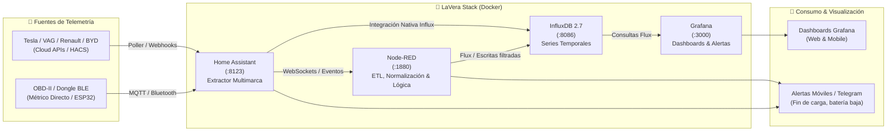

# ⚡ LaVera - Universal EV Telemetry Hub 🚗📊

Plataforma autohospedada (*self-hosted*), modular y privada basada en **Docker** para la extracción, normalización, almacenamiento en series temporales y visualización avanzada de telemetría para **Vehículos Eléctricos (EV)** multimarca (Tesla, Grupo VAG, Renault, BYD, Hyundai/Kia, Stellantis, OBD-II/BLE, Tronity, etc.).

[](docker-compose.yml)
[](https://www.home-assistant.io/)
[](https://www.influxdata.com/)
[](https://nodered.org/)
[](https://grafana.com/)

---

## 🎯 ¿Qué es LaVera?

**LaVera** proporciona una solución integral para propietarios y entusiastas del vehículo eléctrico que desean:
1. **Soberanía y Privacidad de Datos:** Mantener el 100% de los datos telemáticos de sus vehículos en su propia infraestructura local (servidor hogareño, Mini PC, Raspberry Pi o NAS), sin depender exclusivamente de servidores de terceros o planes de suscripción de fabricantes.
2. **Compatibilidad Multimarca:** Recolectar datos telemáticos tanto de APIs oficiales de fabricantes (vía Home Assistant / HACS) como de dongles locales OBD-II por BLE/WiFi.
3. **Análisis de Series Temporales:** Historial continuo en InfluxDB 2.x de métricas críticas: Estado de Carga (SoC), curvas de potencia de recarga (kW), degradación de batería (SOH), eficiencia energética (kWh/100 km), temperatura del paquete de celdas, odómetro y costes energéticos.
4. **Visualización en Tiempo Real:** Paneles interactivos y profesionales en Grafana listos para escritorio o dispositivos móviles.

---

## 🏗️ Arquitectura del Sistema



---

## 🧩 Componentes del Stack

| Servicio | Contenedor | Puerto Local | Función Principal |
| :--- | :--- | :--- | :--- |
| **Home Assistant** | `telemetry_ha` | `8123` | Conector multimarca de vehículos, gestión de integraciones oficiales/HACS y lectura de sensores. |
| **InfluxDB 2.7** | `telemetry_influxdb` | `8086` | Base de datos de series temporales de alto rendimiento para el histórico de telemetría. |
| **Node-RED** | `telemetry_nodered` | `1880` | Pipeline de automatización, orquestación de eventos, normalización de unidades y cálculo de costes. |
| **Grafana** | `telemetry_grafana` | `3000` | Motor de visualización analítica, curvas de carga y alertas de estado. |

---

## 📁 Estructura del Repositorio

```text
LaVera/
├── .gitignore                      # Exclusiones de Git a nivel raíz (datos locales, .env)
├── README.md                       # Documento principal del repositorio
├── GUIA.md                         # Guía exhaustiva de configuración paso a paso
└── ev-telemetry-hub/               # Despliegue de Docker Compose
    ├── docker-compose.yml          # Definición de los 4 servicios integrados
    ├── .env.example                # Plantilla de credenciales y variables de entorno
    ├── .gitignore                  # Exclusiones de datos persistentes locales
    ├── README.md                   # Resumen rápido del hub
    └── data/                       # [Ignorado en Git] Volúmenes persistentes locales
        ├── grafana/
        ├── homeassistant/
        ├── influxdb/
        ├── influxdb_config/
        └── nodered/
```

---

## ⚡ Inicio Rápido (Quickstart)

### 1. Requisitos
- [Docker Engine](https://docs.docker.com/engine/install/) (v20.10+) y **Docker Compose v2** (o Docker Desktop en Windows / macOS).
- Git instalado.

### 2. Clonar el repositorio
```bash
git clone https://github.com/cast0rtech/LaVera.git
cd LaVera/ev-telemetry-hub
```

### 3. Configurar variables de entorno
Copia la plantilla `.env.example` para crear tu propio archivo `.env`:
```bash
cp .env.example .env
```
Edita `.env` con tus contraseñas seguras y preferencias:
```env
# InfluxDB Auth
INFLUX_USER=admin
INFLUX_PASS=TuContrasenaSeguraInflux123!
INFLUX_ORG=EV_Telemetry
INFLUX_BUCKET=vehicle_data

# Grafana Auth
GRAFANA_PASS=TuContrasenaSeguraGrafana123!
```

### 4. Iniciar los servicios
```bash
docker compose up -d
```

Verifica el estado de los contenedores:
```bash
docker compose ps
```

### 5. Acceso a las Interfaces Web

- **Home Assistant:** [http://localhost:8123](http://localhost:8123)
- **Grafana:** [http://localhost:3000](http://localhost:3000) *(Usuario: `admin` / Password: definida en `.env`)*
- **Node-RED:** [http://localhost:1880](http://localhost:1880)
- **InfluxDB:** [http://localhost:8086](http://localhost:8086) *(Login configurado en `.env`)*

---

## 📖 Guía Completa de Configuración e Integración

Para configurar la telemetría específica de tu coche, conectar Home Assistant con InfluxDB, evitar el drenaje de batería (*vampire drain*) y configurar paneles en Grafana, consulta nuestra guía detallada:

👉 **[Leer la Guía Completa Paso a Paso (GUIA.md)](GUIA.md)**

Incluye:
- Conexión e integración por marcas: Tesla, Renault/Dacia, Volkswagen ID/VAG, BYD, OBD-II/BLE.
- Creación de Tokens y Buckets en InfluxDB 2.x.
- Métodos de Ingesta (Home Assistant directo vs Node-RED).
- Consultas Flux de ejemplo para Grafana (curvas de carga, degradación SOH, costes).
- Estrategias antidespertar (evitar *Phantom Drain*).
- Backups y despliegue seguro con HTTPS.

---

## 🛡️ Seguridad y Buenas Prácticas

- **Nunca subas tu archivo `.env` a Git:** Contiene contraseñas maestras y tokens. El archivo ya está incluido en [.gitignore](file:///.gitignore).
- **Control de Peticiones a la API del Coche:** Asegúrate de que las integraciones respeten el modo reposo (*sleep*) del vehículo para evitar consumo parásito de la batería de 12V y del paquete principal.
- **Acceso Remoto:** Si deseas acceder fuera de tu red local, utiliza túneles cifrados como **Cloudflare Tunnels**, **Tailscale / WireGuard** o un proxy inverso con certificados SSL/TLS automáticos (Nginx / Traefik).

---

## 🤝 Contribuciones

Las contribuciones, sugerencias de nuevos dashboards y mejoras en las integraciones son bienvenidas:
1. Haz un Fork del repositorio.
2. Crea una rama descriptiva (`git checkout -b feature/nueva-integracion`).
3. Realiza tus cambios y haz commit (`git commit -m 'feat: añadir soporte para X marca'`).
4. Haz push a tu rama (`git push origin feature/nueva-integracion`).
5. Abre un **Pull Request**.

---

## 📄 Licencia

Este proyecto se distribuye bajo la licencia MIT. Consulta el archivo de licencia correspondiente para más detalles.
