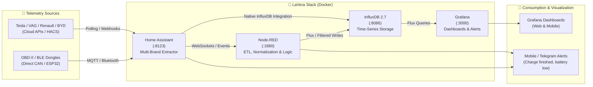

# ⚡ LaVera - Universal EV Telemetry Hub 🚗📊

🌐 **Language / Idioma:** **English** | [Español](README.es.md)

A self-hosted, modular, and privacy-focused **Docker** platform for extracting, normalizing, storing time-series data, and building advanced visualization dashboards for multi-brand **Electric Vehicles (EV)** (Tesla, VAG Group, Renault/Dacia, BYD, Hyundai/Kia, Stellantis, OBD-II/BLE, Tronity, etc.).

[](ev-telemetry-hub/docker-compose.yml)
[](https://www.home-assistant.io/)
[](https://www.influxdata.com/)
[](https://nodered.org/)
[](https://grafana.com/)

---

## 🎯 What is LaVera?

**LaVera** provides an end-to-end, open-source solution for EV owners and enthusiasts who want:
1. **Data Sovereignty & Privacy:** Keep 100% of your vehicle telemetry data on your own local infrastructure (home server, Mini PC, Raspberry Pi, or NAS) without third-party vendor lock-in or subscription fees.
2. **Multi-Brand Compatibility:** Ingest telemetry from official OEM cloud APIs (via Home Assistant & HACS integrations) as well as direct local OBD-II / BLE / CAN dongles.
3. **Time-Series Analytics:** Long-term historical telemetry stored in InfluxDB 2.x for key metrics: State of Charge (SoC), charging power curves (kW), battery degradation (SOH), energy efficiency (kWh/100 km), pack cell temperatures, odometer, and charging costs.
4. **Real-Time Dashboards:** Interactive, responsive Grafana panels tailored for desktop and mobile displays.

---

## 🏗️ System Architecture



---

## 🧩 Stack Components

| Service | Container | Host Port | Primary Role |
| :--- | :--- | :--- | :--- |
| **Home Assistant** | `telemetry_ha` | `8123` | Vehicle connectivity hub, official/HACS vehicle integrations, and sensor poller. |
| **InfluxDB 2.7** | `telemetry_influxdb` | `8086` | High-performance time-series database for raw and downsampled vehicle metrics. |
| **Node-RED** | `telemetry_nodered` | `1880` | Flow-based automation, unit normalization, tariff calculations, and ETL pipelines. |
| **Grafana** | `telemetry_grafana` | `3000` | Analytics visualization engine, charging curve graphs, and automated alerting. |

---

## 📁 Repository Structure

```text
LaVera/
├── .gitignore                      # Root Git exclusions (local data, .env)
├── README.md                       # Main English documentation
├── README.es.md                    # Main Spanish documentation
├── GUIDE.md                        # Comprehensive step-by-step setup guide (English)
├── GUIA.md                         # Comprehensive step-by-step setup guide (Spanish)
└── ev-telemetry-hub/               # Docker Compose deployment files
    ├── docker-compose.yml          # 4-service stack definition
    ├── .env.example                # Environment variables template
    ├── .gitignore                  # Local data ignore rules
    ├── README.md                   # Hub summary in English
    ├── README.es.md                # Hub summary in Spanish
    └── data/                       # [Ignored in Git] Persistent host volumes
        ├── grafana/
        ├── homeassistant/
        ├── influxdb/
        ├── influxdb_config/
        └── nodered/
```

---

## ⚡ Quickstart

### 1. Requirements
- [Docker Engine](https://docs.docker.com/engine/install/) (v20.10+) and **Docker Compose v2** (or Docker Desktop on Windows / macOS).
- Git.

### 2. Clone the Repository
```bash
git clone https://github.com/cast0rtech/LaVera.git
cd LaVera/ev-telemetry-hub
```

### 3. Configure Environment Variables
Copy the `.env.example` template:
```bash
cp .env.example .env
```
Edit `.env` with your secure credentials:
```env
# InfluxDB Auth
INFLUX_USER=admin
INFLUX_PASS=YourSecureInfluxPassword123!
INFLUX_ORG=EV_Telemetry
INFLUX_BUCKET=vehicle_data

# Grafana Auth
GRAFANA_PASS=YourSecureGrafanaPassword123!
```

### 4. Start the Stack
```bash
docker compose up -d
```

Verify that all services are healthy:
```bash
docker compose ps
```

### 5. Access the Web Interfaces

- **Home Assistant:** [http://localhost:8123](http://localhost:8123)
- **Grafana:** [http://localhost:3000](http://localhost:3000) *(User: `admin` / Password: set in `.env`)*
- **Node-RED:** [http://localhost:1880](http://localhost:1880)
- **InfluxDB:** [http://localhost:8086](http://localhost:8086) *(Login set in `.env`)*

---

## 📖 Comprehensive Setup & Integration Guide

For configuring brand-specific vehicle integrations, setting up InfluxDB tokens, preventing vampire/phantom drain, and importing Grafana dashboards:

👉 **[Read the Complete Step-by-Step Guide (English - GUIDE.md)](GUIDE.md)**  
👉 **[Leer la Guía Completa Paso a Paso (Español - GUIA.md)](GUIA.md)**

Highlights:
- Vehicle integration walk-through: Tesla, Renault/Dacia, VAG/Volkswagen ID, BYD, OBD-II/BLE.
- InfluxDB 2.x API token generation and bucket retention policies.
- Ingestion options: Direct Home Assistant configuration vs. Node-RED ETL.
- Ready-to-use Flux queries for Grafana (charging power, SoC gauges, battery health, costs).
- Anti-wake and battery protection strategies (preventing *Phantom Drain*).
- Backups and production SSL/reverse proxy setup.

---

## 🛡️ Security & Best Practices

- **Keep `.env` Private:** Contains master credentials and tokens. It is already ignored by `.gitignore`.
- **Prevent Vampire Drain:** Respect the vehicle's sleep state. Avoid frequent polling when the car is parked and asleep.
- **Secure Remote Access:** Use encrypted tunnels like **Cloudflare Tunnels**, **Tailscale / WireGuard**, or a reverse proxy with valid TLS/SSL certificates (Nginx / Traefik / Caddy) rather than exposing ports directly.

---

## 🤝 Contributing

Contributions, dashboard templates, and integration guides are welcome:
1. Fork this repository.
2. Create a feature branch (`git checkout -b feature/new-brand-integration`).
3. Commit your changes (`git commit -m 'feat: Add support for X brand'`).
4. Push to your branch (`git push origin feature/new-brand-integration`).
5. Open a **Pull Request**.

---

## 📄 License

This project is released under the MIT License. See the license file for more details.
