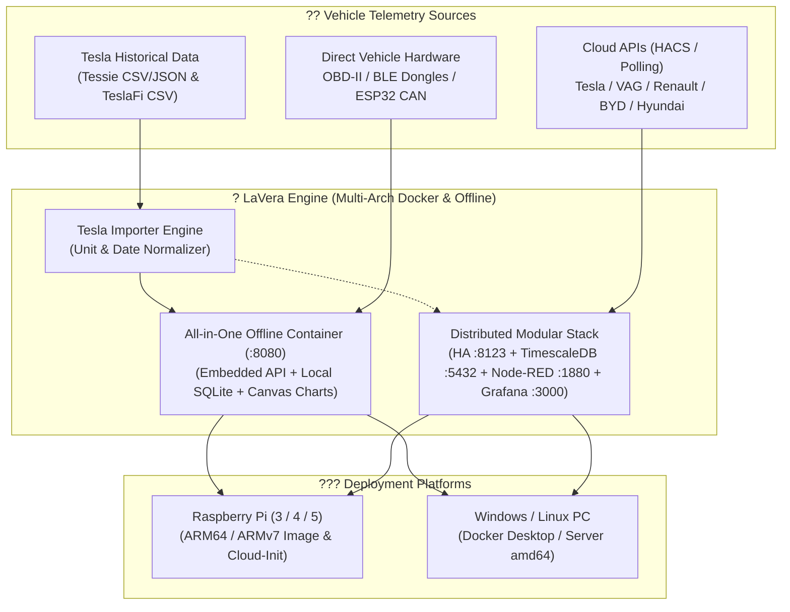

# ? LaVera - Universal EV Telemetry Hub ????

?? **Language / Idioma:** **English** | [Espa?ol](README.es.md)

A self-hosted, modular, and privacy-focused platform for extracting, normalizing, storing time-series data, and building advanced visualization dashboards for multi-brand **Electric Vehicles (EV)** (Tesla, VAG Group, Renault/Dacia, BYD, Hyundai/Kia, Stellantis, OBD-II/BLE, Tronity, etc.).

[](ev-telemetry-hub/docker-compose.all-in-one.yml)
[](scripts/build-arm-image.sh)
[](ev-telemetry-hub/all-in-one/)
[](ev-telemetry-hub/importer/)
[](https://www.timescale.com/)
[](https://grafana.com/)

---

## ?? What is LaVera?

**LaVera** provides an end-to-end, open-source solution for EV owners and enthusiasts who want:
1. **Data Sovereignty & Privacy:** Keep 100% of your vehicle telemetry data on your own local infrastructure (Mini PC, Raspberry Pi, Home Server, or Windows/Linux Docker Desktop) without third-party vendor lock-in or recurring cloud fees.
2. **100% Offline Capability:** Works completely without Internet access in parking garages or in-vehicle installations using an embedded zero-CDN web dashboard and local time-series SQLite persistence.
3. **Tesla Historical Migration (Tessie & TeslaFi):** Import years of drives, charging sessions, idle drain, and battery degradation records from **Tessie** (CSV/JSON) and **TeslaFi** (CSV) with automatic unit and timestamp normalization.
4. **Multi-Architecture & ARM Appliance:** Native pre-configured support for **Raspberry Pi (3, 4, 5)** and ARM SBCs (`linux/arm64`, `linux/arm/v7`, `linux/amd64`) with automated OS image builders and `cloud-init` flashing templates.
5. **Multi-Brand Compatibility:** Ingest telemetry from official OEM cloud APIs (via Home Assistant & HACS integrations) as well as direct local OBD-II / BLE / CAN dongles.

---

## ??? System Architecture



---

## ?? Deployment Profiles

LaVera offers two deployment options:

### 1. All-in-One Offline Hub (Recommended for Raspberry Pi & Local Ingestion)
A single lightweight, zero-configuration Docker container containing:
- Built-in embedded web dashboard (zero CDN, 100% offline).
- Built-in Tesla historical importer (drag & drop for Tessie & TeslaFi).
- Local persistent time-series SQLite storage with optional TimescaleDB (PostgreSQL) syncing.
- Multi-arch support: `linux/amd64`, `linux/arm64`, `linux/arm/v7`.

```bash
cd ev-telemetry-hub
docker compose -f docker-compose.all-in-one.yml up -d
```
Open your browser at `http://localhost:8080` (or `http://lavera.local:8080` on Raspberry Pi).

### 2. Distributed Modular Stack (Home Assistant + TimescaleDB + Node-RED + Grafana)
Full multi-service environment for multi-brand cloud polling and enterprise Grafana analytics.

```bash
cd ev-telemetry-hub
cp .env.example .env
docker compose up -d
```
- **Home Assistant:** `http://localhost:8123`
- **Grafana:** `http://localhost:3000`
- **Node-RED:** `http://localhost:1880`
- **TimescaleDB (PostgreSQL 16):** `localhost:5432` (User: `lavera`, DB: `lavera_telemetry`)

---

## ?? Importing Tesla Data (Tessie & TeslaFi)

If you are migrating from **Tessie** or **TeslaFi**, LaVera preserves your historical telemetry:

### Supported Formats
- **TeslaFi:**
  - `drives.csv` (Date, Distance, Start/End SoC, Wh/mi or Wh/km, Temp, Locations).
  - `charges.csv` (Energy added kWh, Range added, Peak kW, Cost, Fast charging).
  - `battery_report.csv` / `calendar.csv` (Degradation %, Max range at 100%, Capacity kWh).
  - `idles.csv` / `sleep.csv` (Vampire / phantom drain duration and battery loss).
- **Tessie:**
  - Full JSON export (`drives`, `charges`, `battery_health`).
  - CSV exports for drives and charges.

### Import Methods
1. **Web Dashboard:** Open `http://localhost:8080` ? Go to tab **Importar Tessie / TeslaFi** ? Drag and drop your CSV/JSON files.
2. **CLI Utility:**
   ```bash
   # Import TeslaFi drives
   python -m importer.cli --source teslafi --type drives --file /path/to/drives.csv --vin MY_TESLA

   # Import Tessie JSON
   python -m importer.cli --source tessie --file /path/to/tessie.json --vin MY_TESLA
   ```

---

## ?? Raspberry Pi & BalenaEtcher Flashing

?? **[Step-by-Step Flashing Guide for Raspberry Pi Imager & Balena (docs/FLASHING_GUIDE.md)](docs/FLASHING_GUIDE.md)**

## ?? Raspberry Pi & ARM Appliance Images

LaVera can be deployed as an autonomous, self-booting appliance on Raspberry Pi (Pi 3, 4, 5) and ARM boards (Orange Pi, Rock Pi, Armbian):

### Option 1: Automated Raspberry Pi Imager Flashing (`cloud-init`)
Use the preconfigured [`scripts/cloud-init-lavera.yaml`](scripts/cloud-init-lavera.yaml) in **Raspberry Pi Imager** (under *OS Customization* / *user-data*). When the Pi boots:
1. Docker and Avahi (mDNS) are automatically provisioned.
2. LaVera All-in-One is launched as a persistent `systemd` service.
3. Access the dashboard from your phone, laptop, or car screen at `http://lavera.local:8080`.

### Option 2: Build an ARM Bundle / Tarball
Run the builder script from any Linux/macOS or WSL workstation:
```bash
bash scripts/build-arm-image.sh arm64
```
This builds multi-arch Docker layers and packages a complete offline deployment archive for your board.

---

## ?? Repository Structure

```text
LaVera/
??? .gitignore                          # Root Git exclusions (local data, .env)
??? README.md                           # Main English documentation
??? README.es.md                        # Main Spanish documentation
??? GUIDE.md                            # Comprehensive step-by-step setup guide (English)
??? GUIA.md                             # Comprehensive step-by-step setup guide (Spanish)
??? scripts/
?   ??? build-arm-image.sh              # ARM & Raspberry Pi image builder
?   ??? cloud-init-lavera.yaml          # Unattended cloud-init for Raspberry Pi Imager
?   ??? lavera-service.sh               # Systemd background service installer
??? ev-telemetry-hub/
    ??? Dockerfile.all-in-one           # Multi-arch offline container (amd64, arm64, arm/v7)
    ??? docker-compose.all-in-one.yml   # Single-container offline compose stack
    ??? docker-compose.yml              # 4-service distributed stack
    ??? .env.example                    # Environment credentials template
    ??? importer/                       # Tesla (Tessie & TeslaFi) normalizers & CLI
    ?   ??? normalizer.py
    ?   ??? teslafi_parser.py
    ?   ??? tessie_parser.py
    ?   ??? writer.py
    ?   ??? cli.py
    ??? all-in-one/                     # Offline API & Zero-CDN Web Dashboard
    ?   ??? app.py                      # Multi-arch HTTP server & API
    ?   ??? storage.py                  # Local SQLite time-series engine
    ?   ??? web/                        # Responsive dark-mode dashboard
    ?       ??? index.html
    ?       ??? styles.css
    ?       ??? chart-mini.js           # Lightweight offline Canvas chart engine
    ?       ??? app.js
    ??? tests/                          # Automated unit and API test suite
        ??? test_importers.py
        ??? test_all_in_one_api.py
```

---

## ?? Comprehensive Setup & Integration Guide

For configuring brand-specific vehicle integrations, configuring TimescaleDB hypertables, preventing vampire/phantom drain, and importing Grafana dashboards:

?? **[Read the Complete Step-by-Step Guide (English - GUIDE.md)](GUIDE.md)**  
?? **[Leer la Gu?a Completa Paso a Paso (Espa?ol - GUIA.md)](GUIA.md)**

---

## ??? Security & Best Practices

- **Keep `.env` Private:** Contains master credentials and tokens (ignored in git).
- **Prevent Vampire Drain:** Respect the vehicle's sleep state. Avoid aggressive polling when the vehicle is parked and sleeping.
- **Offline Operation:** The All-in-One container makes **zero external network requests**, ensuring absolute data privacy.
- **Secure Remote Access:** Use encrypted tunnels like **Tailscale / WireGuard** or Cloudflare Tunnels rather than opening raw ports to the public Internet.

---

## ?? License

This project is released under the MIT License. See the license file for details.
