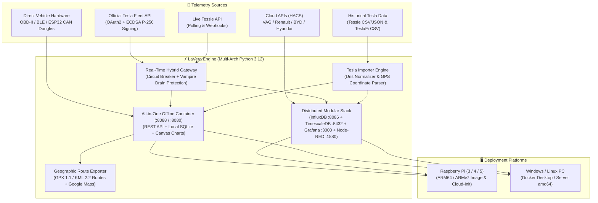

# ⚡ LaVera - Universal EV Telemetry Hub 🚗🔌

🌐 **Language / Idioma:** **English** | [Español](README.es.md)

A self-hosted, modular, and privacy-focused platform for extracting, normalizing, storing time-series data, and visualizing multi-brand **Electric Vehicle (EV)** telemetry (Tesla, VAG Group, Renault/Dacia, BYD, Hyundai/Kia, Stellantis, OBD-II/BLE, Tronity, etc.).

[](ev-telemetry-hub/docker-compose.all-in-one.yml)
[](scripts/build-arm-image.sh)
[](ev-telemetry-hub/all-in-one/)
[](ev-telemetry-hub/importer/)
[](ev-telemetry-hub/gateway/)
[](https://www.influxdata.com/)
[](https://www.timescale.com/)
[](https://grafana.com/)

---

## 🚀 What is LaVera?

**LaVera** provides an end-to-end, open-source, privacy-first solution for EV owners and enthusiasts:

1. **Data Sovereignty & Privacy:** Keep 100% of your vehicle telemetry on your own local infrastructure (Mini PC, Raspberry Pi, home server, or Docker Desktop on Windows/Linux) without third-party vendor lock-in or recurring cloud fees.
2. **100% Offline Capability:** Operates completely without Internet access (in underground parking garages or installed directly inside the vehicle) using an embedded zero-CDN web dashboard and local time-series SQLite persistence.
3. **Real-Time Hybrid Gateway (`gateway/`):** Continuous, secure connection to official **Tesla Fleet API** (OAuth2 and ECDSA NIST P-256 cryptographic command signing) and **Tessie API**, featuring adaptive sleep polling to eliminate vampire drain and circuit breakers for quota protection.
4. **Geographic Route Exports (GPX, KML & Google Maps):** Automatically extracts exact GPS coordinates from every drive and provides instant downloads for **Garmin, Strava, OsmAnd (GPX 1.1)** and **Google Earth (KML 2.2)**, plus direct navigation links in **Google Maps** with pinpoint start and end markers.
5. **Tesla Historical Migration (Tessie & TeslaFi):** Import years of drives, charging sessions, idle drain, and battery degradation logs from **Tessie** (CSV/JSON) and **TeslaFi** (CSV) with automatic timestamp and unit normalization.
6. **Time-Series Storage (SQLite, InfluxDB v2 & TimescaleDB):** Direct InfluxDB v2 Line Protocol streaming via continuous injector script ([`scripts/influx_telemetry_injector.py`](ev-telemetry-hub/scripts/influx_telemetry_injector.py)) and enterprise TimescaleDB (PostgreSQL 16) for large-scale analysis.
7. **Multi-Architecture & ARM Appliance:** Native **Python 3.12 LTS Slim** base image tested on **Raspberry Pi (3, 4, 5)** and ARM SBCs (`linux/arm64`, `linux/arm/v7`, `linux/amd64`), automated OS image generation, and flashing support for BalenaEtcher and Raspberry Pi Imager.

---

## 📐 System Architecture


```mermaid
flowchart TD
    subgraph Sources ["📡 Telemetry Sources"]
        TeslaFleet["Official Tesla Fleet API
(OAuth2 + ECDSA P-256 Signing)"]
        TessieAPI["Live Tessie API
(Polling & Webhooks)"]
        TeslaHist["Historical Tesla Data
(Tessie CSV/JSON & TeslaFi CSV)"]
        OEM["Cloud APIs (HACS)
VAG / Renault / BYD / Hyundai"]
        OBD["Direct Vehicle Hardware
OBD-II / BLE / ESP32 CAN Dongles"]
    end

    subgraph CoreEngine ["⚡ LaVera Engine (Multi-Arch Python 3.12)"]
        direction TB
        Gateway["Real-Time Hybrid Gateway
(Circuit Breaker + Vampire Drain Protection)"]
        Importer["Tesla Importer Engine
(Unit Normalizer & GPS Coordinate Parser)"]
        AllInOne["All-in-One Offline Container (:8088 / :8080)
(REST API + Local SQLite + Canvas Charts)"]
        GeoExport["Geographic Route Exporter
(GPX 1.1 / KML 2.2 Routes + Google Maps)"]
        ModStack["Distributed Modular Stack
(InfluxDB :8086 + TimescaleDB :5432 + Grafana :3000 + Node-RED :1880)"]
    end

    subgraph Targets ["🖥️ Deployment Platforms"]
        RPi["Raspberry Pi (3 / 4 / 5)
(ARM64 / ARMv7 Image & Cloud-Init)"]
        WinLin["Windows / Linux PC
(Docker Desktop / Server amd64)"]
    end

    TeslaFleet --> Gateway
    TessieAPI --> Gateway
    TeslaHist --> Importer
    OBD --> AllInOne
    OEM --> ModStack

    Gateway --> AllInOne
    Gateway --> ModStack
    Importer --> AllInOne
    Importer -.-> ModStack
    AllInOne --> GeoExport

    AllInOne --> RPi
    AllInOne --> WinLin
    ModStack --> WinLin
    ModStack --> RPi
```

---

## 📦 Deployment Profiles

LaVera offers two deployment options to match your infrastructure requirements:

### 1. All-in-One Offline Hub (Recommended for Raspberry Pi & Local Ingestion)
A single lightweight, zero-configuration Docker container (Python 3.12-slim base) containing:
- Built-in embedded web dashboard (zero CDN, 100% offline).
- Real-time live gateway and vampire drain sleep protection.
- Built-in Tesla historical importer (drag & drop for Tessie & TeslaFi).
- Route export in **GPX** and **KML** formats with **Google Maps** integration.
- Local persistent time-series SQLite storage with optional InfluxDB syncing.
- Multi-arch support: `linux/amd64`, `linux/arm64`, `linux/arm/v7`.

```bash
cd ev-telemetry-hub
docker compose -f docker-compose.all-in-one.yml up -d
```
Open your browser at `http://localhost:8088` or `http://localhost:8080` (or `http://lavera.local:8088` on Raspberry Pi).

### 2. Distributed Modular Stack (InfluxDB 2.7 + TimescaleDB + Grafana + Node-RED + Home Assistant)
Full multi-service environment for multi-brand cloud polling and enterprise Grafana analytics.

```bash
cd ev-telemetry-hub
cp .env.example .env
docker compose up -d
```
- **LaVera Hub Dashboard:** `http://localhost:8088`
- **InfluxDB v2:** `http://localhost:8086` *(Org: `lavera`, Bucket: `ev_telemetry`)*
- **Grafana:** `http://localhost:3000` *(User: `admin` / Password: in `.env`)*
- **TimescaleDB (PostgreSQL 16):** `localhost:5432` *(User: `lavera`, DB: `lavera_telemetry`)*
- **Node-RED:** `http://localhost:1880`
- **Home Assistant:** `http://localhost:8123`

---

## 🗺️ Route Tracking & Geographic Exporters (GPX, KML & Google Maps)

LaVera automatically captures GPS trackpoints (`latitude`, `longitude`) from imported files or live telemetry streams:

- **GPX 1.1 Export:** Full compatibility with Garmin Connect, Strava, Komoot, and OsmAnd (`/api/drives/export?id=<ID>&format=gpx`).
- **KML 2.2 Export:** Directly open your drives in Google Earth or GIS applications (`/api/drives/export?id=<ID>&format=kml`).
- **Google Maps Navigation:** Every drive table row features a direct route preview button linking origin to destination coordinates (`https://www.google.com/maps/dir/?api=1&origin=LAT,LON&destination=LAT,LON`).

---

## 📊 Real-Time Telemetry & Time-Series Mapping

LaVera structures continuous streaming telemetry from the **Tesla Fleet API**, **Tessie API**, and **Fleet Telemetry** into 5 core domains with an optimized schema for InfluxDB and TimescaleDB:

> **Time-Series Storage Pattern:**
> - **Tags (Low-Cardinality Indexes):** `string` and `boolean` attributes (e.g. `charging_state`, `shift_state`, `locked`, `sentry_mode`, `is_climate_on`) for instantaneous faceted queries and grouping.
> - **Fields (Numerical Time-Series Metrics):** `int` and `float` variables (e.g. `power`, `speed`, `odometer`, `inside_temp`, `charger_power`) for continuous curve rendering, energy integrals, and analytical dashboards in Grafana.

1. **🔋 `charge_state` (Energy & Battery):**
   - **Fields:** `battery_level` (SoC %), `usable_battery_level` (net SoC %), `charge_limit_soc` (%), `battery_range` (km), `charger_voltage` (V), `charger_actual_current` (A), `charge_current_request` (A), `charge_current_request_max` (A), `charger_power` (kW), `charge_energy_added` (kWh), `time_to_full_charge` (h).
   - **Tags:** `charging_state` (`Disconnected`, `Charging`, `Complete`, `Stopped`), `charge_port_door_open`, `charge_port_latch` (`Engaged`/`Disengaged`), `conn_charge_cable`, `battery_heater_on`, `fast_charger_present`.

2. **🌡️ `climate_state` (Climate Control & Ambient Sensors):**
   - **Fields:** `inside_temp` (°C), `outside_temp` (°C), `driver_temp_setting` (°C), `passenger_temp_setting` (°C), `fan_status` (0-7), `defrost_mode` (0-2), seat heating levels (`seat_heater_left`, `seat_heater_right`, rear rows 0-3).
   - **Tags:** `is_climate_on`, `is_auto_conditioning_on`, `climate_keeper_mode` (`off`, `keep`, `dog`, `camp`), `steering_wheel_heater`, `cabin_overheat_protection` (`On`, `Off`, `FanOnly`).

3. **🛣️ `drive_state` (Vehicle Dynamics & Geolocation):**
   - **Fields:** `speed` (km/h), `power` (net kW: positive acceleration / negative regen), `latitude` (WGS84), `longitude` (WGS84), `heading` (0-359°), `gps_as_of` (epoch timestamp), `active_route_energy_at_arrival` (SoC %), `active_route_traffic_minutes_delay` (min).
   - **Tags:** `shift_state` (`P`, `R`, `N`, `D`), `active_route_destination`.

4. **🚘 `vehicle_state` (Hardware, Body & Security):**
   - **Fields:** `odometer` (total km), `tpms_pressure_fl` / `fr` / `rl` / `rr` (tire pressure in Bar), door closures (`df`, `pf`, `dr`, `pr`), windows (`fd_window`, `fp_window`, etc.), trunks (`ft`, `rt`), `center_display_state` (0=off, 2=on).
   - **Tags:** `locked` (`true`/`false`), `sentry_mode`, `is_user_present`, `car_version` (firmware), `software_update.status`.

5. **📡 Fleet Telemetry / Advanced Diagnostics:**
   - **Fields:** `BrakePedalPos` (% cylinder pressure), `ACChargingEnergyIn` (kWh), `DCChargingEnergyIn` (kWh), `BrickVoltageMax` / `BrickVoltageMin` (cell brick voltages for imbalance diagnosis), `DiInverterTR` / `DiInverterTF` (drive unit inverter temperatures in °C).
   - **Tags:** `BmsFullchargecomplete` (100% cell balancing completion flag).

---

## 🔄 Tesla Historical Importer (Tessie & TeslaFi)

Consolidate all historical driving, charging, and battery degradation logs from **Tessie** or **TeslaFi**:

### Supported Formats
- **TeslaFi:**
  - `drives.csv` (Date, Distance, start/end SoC, Wh/km or Wh/mi, Temperatures, Locations, GPS coordinates, Autopilot).
  - `charges.csv` (Energy added kWh, Range added, Peak kW, Cost, Fast charger type).
  - `battery_report.csv` / `calendar.csv` (Degradation %, 100% Range, Pack Capacity kWh).
  - `idles.csv` / `sleep.csv` (Sleep/idle duration and phantom drain loss).
- **Tessie:**
  - Full JSON export (`drives`, `charges`, `battery_health`).
  - CSV exports for drives and charges with exact GPS coordinates.

### How to Import
1. **Web Dashboard:** Open `http://localhost:8088` ➔ Tab **Importar Tessie / TeslaFi** ➔ Drag and drop your CSV or JSON files.
2. **Command Line Interface (CLI):**
   ```bash
   # Import TeslaFi drives CSV
   python -m importer.cli --source teslafi --type drives --file /path/to/drives.csv --vin MY_TESLA

   # Import Tessie JSON export
   python -m importer.cli --source tessie --file /path/to/tessie_export.json --vin MY_TESLA
   ```

---

## 🥧 Raspberry Pi & ARM Appliance Images

LaVera can be deployed as an autonomous, plug-and-play appliance on Raspberry Pi (3, 4, 5) and ARM SBCs (Orange Pi, Rock Pi, Armbian):

📖 **[Flashing Guide for Raspberry Pi Imager & BalenaEtcher (docs/FLASHING_GUIDE.md)](docs/FLASHING_GUIDE.md)**

### Option 1: Generate Flashable Disk Image (.img.xz)
Downloads the latest official Raspberry Pi OS Lite release and pre-configures LaVera:
```bash
python scripts/create-pi-image.py --username lavera --password lavera
```

### Option 2: Automated Flashing via `cloud-init`
Use the pre-configured [`scripts/cloud-init-lavera.yaml`](scripts/cloud-init-lavera.yaml) inside **Raspberry Pi Imager** custom OS settings (*user-data*):
1. Docker and Avahi (mDNS) are installed automatically on first boot.
2. LaVera All-in-One starts as a persistent `systemd` service.
3. Access the dashboard from your phone, laptop, or car browser at `http://lavera.local:8088`.

### Option 3: Compile ARM Offline Bundle
Run the builder script from any Linux or WSL workstation:
```bash
bash scripts/build-arm-image.sh arm64
```

---

## 📁 Repository Structure

```text
LaVera/
├── .gitignore                          # Git exclusions (local data, .env, dist-pi/)
├── README.md                           # Main English documentation
├── README.es.md                        # Main Spanish documentation
├── GUIDE.md                            # Comprehensive step-by-step guide (English)
├── GUIA.md                             # Comprehensive step-by-step guide (Spanish)
├── Dockerfile                          # Multi-arch root Python 3.12 Dockerfile
├── docker-compose.yml                  # Full distributed stack (Hub, InfluxDB, TimescaleDB, Grafana, HA)
├── docker-compose.all-in-one.yml       # Standalone All-in-One stack
├── scripts/
│   ├── create-pi-image.py              # Raspberry Pi bootfs & SD disk image builder
│   ├── build-arm-image.sh              # ARM multi-arch container builder
│   ├── cloud-init-lavera.yaml          # Unattended Raspberry Pi Imager template
│   └── lavera-service.sh               # systemd service installer script
└── ev-telemetry-hub/
    ├── Dockerfile.all-in-one           # Offline multi-arch container (amd64, arm64, arm/v7)
    ├── docker-compose.all-in-one.yml   # Lightweight local compose file
    ├── docker-compose.yml              # Hub compose configuration
    ├── .env.example                    # Environment variable and credential template
    ├── gateway/                        # Real-time hybrid telemetry gateway
    │   ├── __init__.py
    │   ├── base.py                     # Provider base interface
    │   ├── tesla_fleet_provider.py     # Tesla Fleet API client with ECDSA NIST P-256 signing
    │   ├── tessie_provider.py          # Live Tessie API provider with adaptive polling
    │   ├── polling_manager.py          # Sleep manager & vampire drain prevention
    │   ├── circuit_breaker.py          # Quota preservation & fail-safe circuit breaker
    │   ├── influx_parser.py            # Canonical InfluxDB Line Protocol serializer
    │   ├── models.py                   # Unified canonical data models
    │   ├── security.py                 # Token management & public key cryptography
    │   ├── database.py                 # Persistence layer (SQLite / TimescaleDB)
    │   └── orchestrator.py             # Gateway lifecycle orchestrator
    ├── importer/                       # Tesla normalizers and CLI importer
    │   ├── normalizer.py
    │   ├── teslafi_parser.py           # TeslaFi parser with GPS coordinate extraction
    │   ├── tessie_parser.py            # Tessie parser with GPS coordinate extraction
    │   ├── writer.py                   # SQLite, TimescaleDB & InfluxDB multi-writer
    │   └── cli.py                      # Command-line interface for data imports
    ├── scripts/
    │   └── influx_telemetry_injector.py # InfluxDB v2 HTTP batch & streaming injector
    ├── all-in-one/                     # Zero-CDN Offline Dashboard & API
    │   ├── app.py                      # HTTP server, REST API & GPX/KML route generator
    │   ├── storage.py                  # Local SQLite database engine & metrics
    │   └── web/                        # Responsive dark-mode frontend
    │       ├── index.html
    │       ├── styles.css
    │       ├── chart-mini.js           # Lightweight standalone Canvas chart engine
    │       ├── app.js                  # Frontend controller, map links & download handlers
    │       └── i18n.js                 # Multi-language dictionary (EN, ES, DE, FR, NO)
    └── tests/                          # Unit and integration test suite
        ├── test_importers.py
        ├── test_all_in_one_api.py
        └── test_timescaledb.py
```

---

## 📖 In-Depth Setup & Architecture Guides

For detailed manufacturer API setup, InfluxDB tokens, vampire drain prevention formulas, and Grafana panel configs:

📘 **[Read the Complete Step-by-Step Guide (English - GUIDE.md)](GUIDE.md)**  
📘 **[Leer la Guía Completa Paso a Paso (Español - GUIA.md)](GUIA.md)**

---

## 🔒 Security & Best Practices

- **Keep `.env` Private:** Contains master credentials and tokens (excluded by `.gitignore`).
- **Prevent Vampire Drain:** LaVera respects vehicle sleep cycles (`asleep` / `suspended`) and never issues unnecessary wake-up commands.
- **100% Offline Operation:** The All-in-One container makes zero outbound cloud requests, ensuring total data privacy.
- **Secure Remote Access:** Use encrypted mesh networks such as **Tailscale / WireGuard** or Cloudflare Zero Trust tunnels rather than opening exposed firewall ports.

---

## 📄 License

This project is open-source and released under the MIT License. See the LICENSE file for details.
